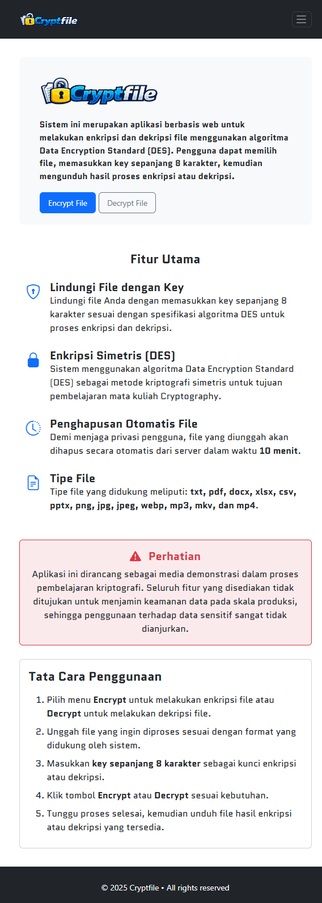
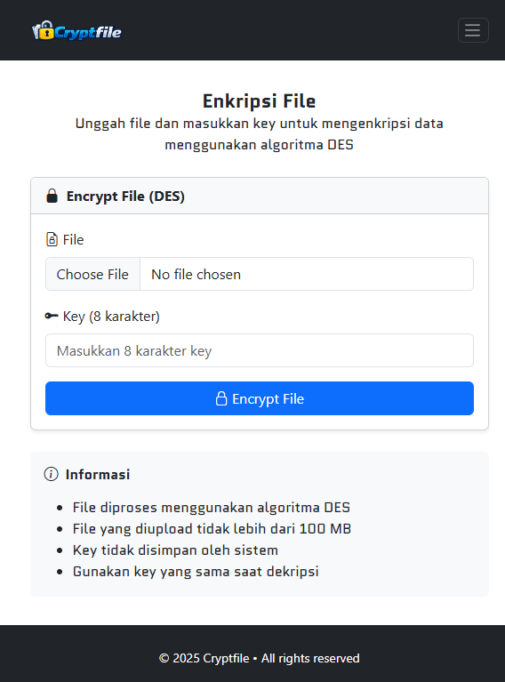

# Cryptfile - DES Web Encryption
A web-based file encryption and decryption system implementing the Data Encryption Standard (DES) algorithm.

This project demonstrates the practical implementation of symmetric cryptography within a web application using a Python (Flask) backend.

---

## Badges


---

## Project Overview

This application allows users to:

- Upload files
- Encrypt files using the DES algorithm
- Decrypt encrypted files
- Download processed results

The system separates the encryption engine from the interface layer to maintain modularity and code clarity.

---

## Screenshots

### Main Interface


### Encryption Process


### Decryption Process


> Store screenshots inside a folder named `screenshots` in the root directory.

---

## Technology Stack

- Python 3
- Flask
- HTML, CSS, JavaScript
- DES Cryptographic Algorithm

---

## DES Implementation Details

- 64-bit block cipher
- 56-bit effective key length
- 16 Feistel rounds
- Initial and Final Permutation
- Subkey generation (key scheduling)
- Encryption and decryption processes

---

## Project Structure

```
app/              Application source code
screenshots/      Documentation images
run.py            Application entry point
requirements.txt  Python dependencies
README.md         Project documentation
```

---

## Installation and Setup

### 1. Clone the Repository

```
git clone https://github.com/Bobiafrianto/des-encryption-project.git
cd des-encryption-project
```

### 2. Create and Activate Virtual Environment

Windows:

```
python -m venv venv
venv\Scripts\activate
```

macOS / Linux:

```
python3 -m venv venv
source venv/bin/activate
```

### 3. Install Dependencies

```
pip install -r requirements.txt
```

### 4. Run the Application

```
python run.py
```

The application will run on:

```
http://localhost:5000
```

---

## Requirements

- Python 3.x
- pip
- Virtual environment (recommended)
Create a virtual environment:
